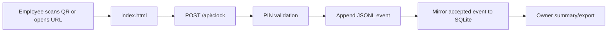

# System Overview

```mermaid
flowchart LR
  A[Employee scans QR or opens URL] --> B[index.html]
  B --> C[POST /api/clock]
  C --> D[PIN validation]
  D --> E[Append JSONL event]
  E --> F[Mirror accepted event to SQLite]
  F --> G[Owner summary/export]
```

The JSONL event ledger is the source of truth. SQLite is a query mirror. Owner outputs are exports.
